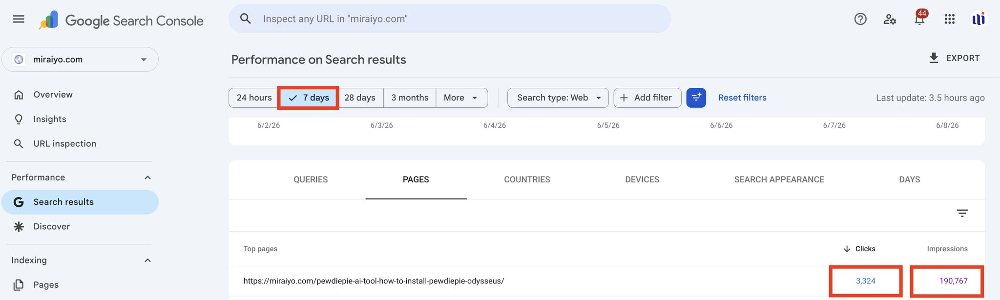

# Odysseus Install Guide — Google Search Performance

**A technical-writing case study with original Google Search Console data supporting the first-week performance of my installation guide.**

**Author:** Adrita Chakraborty  
**Published article:** [PewDiePie AI Tool: How to Install PewDiePie Odysseus?](https://miraiyo.com/pewdiepie-ai-tool-how-to-install-pewdiepie-odysseus/)  
**Publisher:** Miraiyo  
**Publication date:** June 2, 2026

## Key results

These are **article-specific** metrics from the matching URL row in [`data/Pages.csv`](data/Pages.csv), not the overall website totals.

| Metric | Verified result |
|---|---:|
| Google Search clicks | **3,324** |
| Google Search impressions | **190,767** |
| Click-through rate (CTR) | **1.74%** |
| Reporting period | **June 2–8, 2026** |
| Search type | **Web** |

The article was published on June 2, 2026, two days after Odysseus launched on May 31, 2026.

## Screenshot

## How the numbers were calculated

**Source:** A Google Search Console performance export provided by the article's author.

- **Date range:** June 2–8, 2026, as recorded in [`data/Filters.csv`](data/Filters.csv).
- **Search type:** Web, as recorded in [`data/Filters.csv`](data/Filters.csv).
- **Article identification:** Exact page URL in [`data/Pages.csv`](data/Pages.csv).
- **Clicks and impressions:** The **3,324 clicks** and **190,767 impressions** in that page's row.
- **CTR formula:** `(clicks / impressions) × 100` = `(3,324 / 190,767) × 100` ≈ **1.74%**.

**Important scope note:** [`data/Chart.csv`](data/Chart.csv) includes daily rows for the overall exported Search Console view. It is **not a daily breakdown for this article**. Do not add its daily values to obtain article-specific totals. See [`analysis/calculations.md`](analysis/calculations.md) for the comparison and the highest day in that broader daily series.

## Files

| File | Purpose |
|---|---|
| [`README.md`](README.md) | Summary, source, metrics, and reproduction steps. |
| [`case-study.md`](case-study.md) | Technical-writing case study and interpretation. |
| [`analysis/calculations.md`](analysis/calculations.md) | Reproducible CTR calculation and carefully labeled daily-chart analysis. |
| [`data/README.md`](data/README.md) | Column definitions, file scopes, and reading guidance. |
| [`data/Pages.csv`](data/Pages.csv) | **Primary evidence**: page-level metrics for the article. |
| [`data/Filters.csv`](data/Filters.csv) | Export filters and reporting dates. |
| [`data/Chart.csv`](data/Chart.csv) | Overall daily Search Console results, **not article-level daily data**. |
| [`data/Queries.csv`](data/Queries.csv) | Exported search-query rows. |
| [`data/Countries.csv`](data/Countries.csv) | Exported country breakdown. |
| [`data/Devices.csv`](data/Devices.csv) | Exported device breakdown. |
| [`data/Search appearance.csv`](data/Search%20appearance.csv) | Exported search-appearance breakdown. |

## Reproduce the central result

1. Open [`data/Filters.csv`](data/Filters.csv) and confirm **Web** and **June 2–8, 2026**.
2. Open [`data/Pages.csv`](data/Pages.csv) and find the exact [article URL](https://miraiyo.com/pewdiepie-ai-tool-how-to-install-pewdiepie-odysseus/).
3. Read the **Clicks** and **Impressions** columns for **that row only**.
4. Divide clicks by impressions, then multiply by 100 and round the percentage to two decimal places.

**Data exported from Google Search Console by the author. Shared with permission of Miraiyo.**
